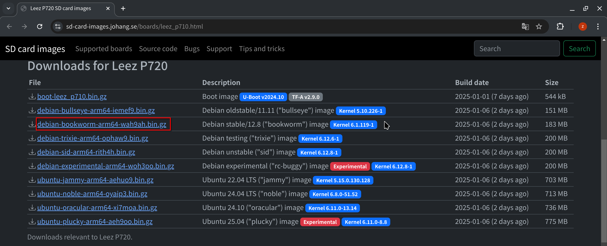
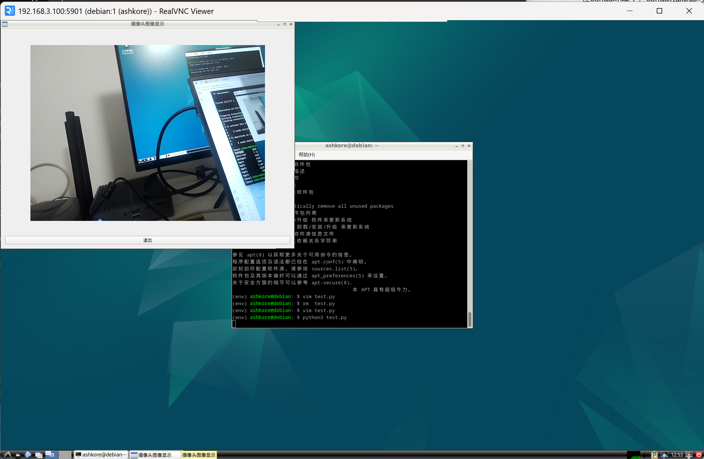

# EAIDK-310使用记录

本文档主要介绍如何给EAIDK-310更换系统，包括如何[获取并配置rootfs](#获取并配置rootfs)（根文件系统），[烧录镜像](#烧录镜像)，[开发环境配置](#开发环境配置)，[使用tf卡](#使用tf卡)，以及附加内容：[I2C和SPI示例](#I2C和SPI示例)。

## 获取并配置rootfs

该步骤涉及对rootfs的挂载，所以最好在Linux环境下进行操作，我的电脑是windows和linux双系统，虚拟机的linux也可以完成，该步骤的操作都在Arch Linux下进行。

由于该开发板的官网已经跑路，无法获得后续的官方支持，可以用原来自带的Linux4.4内核为基础，运行debian12等比较新的发行版。

参考CSDN的一篇[博客](https://blog.csdn.net/Elko_265/article/details/131316611)，可以直接去SD card images网站下载debian的rootfs而不需要手动构建，网站[链接](https://sd-card-images.johang.se/boards/leez_p710.html)，在Downloads for Leez P720栏目下选择`
debian-bookworm-arm64-xxxxxx.bin.gz`下载rootfs，文件名的xxxxxx是root密码，debian-bookworm就是debian12，arm64代表系统架构。



使用zcat解压下载的rootfs，重定向输出到映像文件

```shell
zcat debian-bookworm-arm64-xxxxxx.bin.gz > rootfs_debian12.img
```

扩大映像文件到7400MB

```shell
dd if=/dev/zero bs=1M count=0 seek=7400 of=rootfs_debian12.img
```

新建一个目录，用于挂载rootfs

```shell
mkdir rootfs
```

wifi驱动和蓝牙驱动在旧rootfs的`/system`目录下，需要挂载把`/system`复制出来，旧rootfs指的是官方提供的fedora28的rootfs

```shell
sudo mount -o loop rootfs.img rootfs
sudo cp -r rootfs/system .
sudo umount rootfs
```

挂载新rootfs到这个目录，注意这里的rootfs是新的debian12的rootfs，然后把system复制到新rootfs

```shell
sudo mount -o loop rootfs_debian12.img rootfs
sudo cp -r system rootfs/
```

即使映像文件扩大到7400MB，rootfs的分区大小仍然是原来的大小，使用resize2fs命令扩大分区

```shell
sudo resize2fs /dev/loop0
```

因为本机的架构为x86_64，rootfs的架构为arm64，需要安装binfmt支持跨架构运行，其他Linux发行版自行替换下面的命令

```shell
sudo pacman -Sy qemu-user-static-binfmt
```

安装arch-install-scripts，其提供的的arch-chroot命令比chroot更方便，可以自动挂载/proc、/sys、/dev等目录

```shell
sudo pacman -Sy arch-install-scripts
```

使用arch-chroot进入该镜像

```shell
sudo arch-chroot rootfs
```

如果未发生任何错误，应该能看到提示符`root@主机名:/#`

设置PATH变量

```shell
export PATH=/usr/sbin:/usr/bin:/sbin:/bin
```

换apt源

```shell
sed -i 's/deb.debian.org/mirrors.ustc.edu.cn/g' /etc/apt/sources.list
sed -i 's/security.debian.org/mirrors.ustc.edu.cn/g' /etc/apt/sources.list
```

安装本地化支持

```shell
apt update
apt install -y dialog locales
dpkg-reconfigure locales
```

此时会弹出对话框，一直按方向下找到`zh_CN.UTF-8 UTF-8`，按空格选中，回车，再选中`zh_CN.UTF-8`，回车，等待生成配置结束，可以输入`apt`观察输出确认本地化是否成功


安装常用系统组件，本次安装时，python的版本为3.11，gcc的版本为12，cmake的版本为3.25

```shell
apt install -y sudo python3 vim apt-utils wget curl net-tools iputils-ping ca-certificates rsync file binutils build-essential cmake git pkg-config
```

新建一个普通用户，默认shell为bash，加入到sudo组里，username替换成用户名

```shell
useradd -m -s /bin/bash -G sudo username
```

设置这个用户的密码，根据提示输入密码，注意输入的密码不会显示在屏幕上

```shell
passwd username
```

建议也设置root密码

```shell
passwd
```

安装图形界面，由于开发板的性能有限，建议安装轻量级的桌面环境，如lxde、lxqt、xfce4

这里给xfce4和lxde进行简单对比，xfce4个人感觉比lxde美观一点，xfce4安装需要使用大约0.9G的存储空间，进入系统后内存占用大约350M，lxde安装需要使用大约0.8G的存储空间，进入系统后内存占用大约260M，结合开发板资源和项目需求考虑后我选择安装lxde，注意要安装core版本。

```shell
apt install -y lxde-core
```

安装中文字体，避免乱码

```shell
apt install -y fonts-wqy-microhei
```

安装NetworkManager，用于管理网络连接，还有托盘图标和配置工具

```shell
apt install -y network-manager nm-tray network-manager-gnome
```

（可选）如果有在开发板上使用浏览器的需求，可以安装falkon
    
```shell
apt install -y falkon
```

最后，可以删除apt下载的安装包，以节省空间

```shell
apt clean
```

rootfs的基础配置完成，可以退出arch-chroot，卸载rootfs

```shell
exit
sudo umount rootfs
```

## 烧录镜像

把制作好的rootfs复制到windows系统，重启到windows系统，打开烧录工具

如果没拆开保护壳，开发板的reset按键可以直接伸手进去按到，但是recover和maskrom按键需要找个牙签之类的小棍子才能捅到。

选择debian12的镜像文件，然后点击“执行”按钮，等待烧录完成。


烧录完成后，使用HDMI线连接显示器，插上键盘鼠标，插上供电线，等待系统启动，在lightdm登录界面输入用户名和密码，即可进入桌面环境。

## 后续系统配置

因为开发板的wifi不稳定，建议使用有线网络连接，将网线插入电脑和开发板之间，需要给有线网卡设置静态的ip地址，使用NetworkManager来设置。

### 命令方式

点击启动器里的终端模拟器，打开终端，输入下面的命令，获取有线网卡的名字。

```shell
nmcli con show
```

找到有线连接的名字，一般是`Wired connection 1`，如果已经本地化，名字会变成`有线连接 1`，输入下面的命令，设置静态ip地址：

```shell
nmcli con mod "有线连接 1" ipv4.method manual ipv4.addresses 192.168.3.100 ipv4.gateway 192.168.3.101
```

因为没装中文输入法，可以直接把上一条命令输出的连接名字复制再粘贴到终端里。

或者使用nmtui来设置，输入命令`nmtui`，进入nmtui界面，选择`Edit a connection`，选择有线连接，按回车，选择`IPv4 CONFIGURATION`，按回车，选择`Manual`，按回车，输入ip地址和网关，按回车，按`OK`，按`Back`，按`Quit`，退出nmtui。

### 图形界面方式

在启动器-系统-高级网络设置，设置有线连接的ip地址。

同时，设置自己电脑的ip地址到相同的网段`192.168.3.xxx`，比如`192.168.3.100`，网关设置为开发板的ip地址`192.168.3.100`。


此时，开发板的上网方案有两种，连接可上网的wifi，或者使用有线连接共享电脑的网络，有线方式自行搜索windows共享有线网络的方法。

配置ssh服务，方便远程连接。

生成ssh密钥，重启ssh服务，检查是否正常运行`(active (running))`

```shell
sudo ssh-keygen -A
sudo systemctl restart sshd
sudo systemctl status sshd
```

在电脑上使用ssh连接开发板，打开powershell或终端，输入下面的命令，连接开发板，首次连接时需要输入yes确认，然后再输入密码。

```shell
ssh username@192.168.3.100
```


连接成功后，配置远程桌面服务，方便远程桌面连接。可用的方案有vnc、xrdp、nomachine等，这里使用vnc。

安装vnc服务

```shell
sudo apt install -y tigervnc-standalone-server
```

设置vnc密码

```shell
vncpasswd
```

启动vnc服务，允许局域网设备连接

```shell
vncserver -localhost no
```


在电脑上使用realvnc viewer连接开发板，输入`192.168.3.100:1`，输入vnc密码，即可连接。

如果连接后发现颜色异常，在连接选项中把`picture quality`改为`medium`或`high`，即可解决。


至此，开发板的rootfs配置全部完成，可以用dd工具导出rootfs到外部存储设备。这里使用U盘，插入U盘后，应该会出现在`/dev/sd*`，这里假设U盘是`/dev/sda1`，备份rootfs到U盘，U盘需要是exfat或ntfs等支持大于4G文件的文件系统。

```shell
mkdir usb
sudo mount /dev/sda1 usb
sudo dd if=/dev/mmcblk2p4 of=usb/rootfs_debian12.img bs=4M status=progress
sudo umount usb
```

因为根目录是在没有取消挂载的情况下进行备份，所以备份的rootfs可能会出现问题，可以把rootfs重新烧录一次，看看系统能否启动，配置是否正常。

## 开发环境配置

主要配置c++和python的开发环境。

### python

因为系统中python3的包由软件包管理器管理，所以建议创建虚拟环境，以免冲突

虚拟环境的解决方案有很多，这里使用conda，也可以使用venv、poetry等

conda的提供方案有很多，这里使用miniforge，也可以使用anaconda、miniconda等

miniforge的安装方法参考[官网](https://github.com/conda-forge/miniforge)

```shell
curl -L -O "https://github.com/conda-forge/miniforge/releases/latest/download/Miniforge3-$(uname)-$(uname -m).sh"
bash Miniforge3-$(uname)-$(uname -m).sh
```

跟随提示安装miniforge，需要依次按回车、yes、回车、yes，如果不想启动shell时自动激活conda，最后一步可以输入no，或者根据提示关闭自动激活。

安装完成后，需要重启终端才能生效，可以使用`conda --version`检查是否安装成功。

因为课设需要用到视觉处理库，还有GUI的库，这里以安装opencv和pyqt5为例

先使用conda创建一个虚拟环境，名字为`env`，python版本为3.11

```shell
conda create -n env python=3.11
```

根据提示确认安装，然后激活这个虚拟环境

```shell
conda activate env
```

在conda环境中，conda和pip都可以安装python模块，优先使用conda，如果conda里没有，再使用pip

通过conda安装opencv和pyqt5

```shell
conda install -y opencv pyqt
```

编写一个测试脚本，使用opencv获取摄像头图像，然后交给pyqt去显示，按退出按钮可以关闭程序

```python
import sys
import cv2
import numpy as np
from PyQt5.QtCore import QTimer, Qt
from PyQt5.QtGui import QImage, QPixmap
from PyQt5.QtWidgets import QApplication, QLabel, QVBoxLayout, QPushButton, QWidget

class CameraApp(QWidget):
    def __init__(self):
        super().__init__()
        self.initUI()
        self.cap = cv2.VideoCapture(0)  # 打开摄像头
        if not self.cap.isOpened():
            print("无法打开摄像头")
            sys.exit()

        # 定时器用于刷新摄像头图像
        self.timer = QTimer(self)
        self.timer.timeout.connect(self.update_frame)
        self.timer.start(30)  # 每 30 毫秒刷新一次

    def initUI(self):
        # 设置窗口布局
        self.layout = QVBoxLayout()

        # 用于显示图像的 QLabel
        self.video_label = QLabel(self)
        self.video_label.setAlignment(Qt.AlignCenter)
        self.layout.addWidget(self.video_label)

        # 退出按钮
        self.quit_button = QPushButton("退出", self)
        self.quit_button.clicked.connect(self.close_app)
        self.layout.addWidget(self.quit_button)

        self.setLayout(self.layout)
        self.setWindowTitle("摄像头图像显示")
        self.resize(800, 600)

    def update_frame(self):
        # 从摄像头获取帧
        ret, frame = self.cap.read()
        if not ret:
            print("无法读取摄像头帧")
            return

        # 转换为 RGB 格式
        frame = cv2.cvtColor(frame, cv2.COLOR_BGR2RGB)

        # 转换为 QImage
        height, width, channel = frame.shape
        bytes_per_line = 3 * width
        q_image = QImage(frame.data, width, height, bytes_per_line, QImage.Format_RGB888)

        # 显示图像
        self.video_label.setPixmap(QPixmap.fromImage(q_image))

    def close_app(self):
        # 释放摄像头并退出程序
        self.cap.release()
        self.timer.stop()
        self.close()

    def closeEvent(self, event):
        # 确保关闭窗口时释放摄像头
        self.cap.release()
        self.timer.stop()
        event.accept()

if __name__ == "__main__":
    app = QApplication(sys.argv)
    camera_app = CameraApp()
    camera_app.show()
    sys.exit(app.exec_())
```

运行效果如下：



### c++

安装opencv和qt库

```shell
sudo apt install -y qtbase5-dev qtchooser qt5-qmake qtbase5-dev-tools libopencv-dev
```

编写一个测试程序，使用opencv获取摄像头图像，然后交给qt去显示，按退出按钮可以关闭程序

```cpp
#include <QApplication>
#include <QHBoxLayout>
#include <QLabel>
#include <QPushButton>
#include <QTimer>
#include <QWidget>
#include <QCloseEvent>
#include <QDebug>
#include <opencv2/opencv.hpp>

class CameraApp : public QWidget {
    Q_OBJECT
public:
    explicit CameraApp(QWidget *parent = nullptr) : QWidget(parent), cap(0) {
        label = new QLabel(this);
        label->setAlignment(Qt::AlignCenter);
        
        quitButton = new QPushButton("退出", this);
        
        timer = new QTimer(this);

        QVBoxLayout *layout = new QVBoxLayout(this);
        layout->addWidget(label);
        layout->addWidget(quitButton);
        setLayout(layout);

        // 打开摄像头
        cap.open(0);
        if (!cap.isOpened()) {
            qDebug() << "Error: Cannot access the camera.";
            exit(EXIT_FAILURE);
        }

        // 设置摄像头图像大小为 640x480
        cap.set(cv::CAP_PROP_FRAME_WIDTH, 640);
        cap.set(cv::CAP_PROP_FRAME_HEIGHT, 480);

        connect(timer, &QTimer::timeout, this, &CameraApp::updateFrame);
        connect(quitButton, &QPushButton::clicked, this, &CameraApp::close);

        timer->start(30); // 每 30 毫秒更新一次帧
    }

    ~CameraApp() {
        cap.release();
    }

protected:
    void closeEvent(QCloseEvent *event) override {
        cap.release();
        event->accept();
    }

private slots:
    void updateFrame() {
        cv::Mat frame;
        cap >> frame;
        if (!frame.empty()) {
            cv::cvtColor(frame, frame, cv::COLOR_BGR2RGB);
            QImage qimg(frame.data, frame.cols, frame.rows, frame.step, QImage::Format_RGB888);
            label->setPixmap(QPixmap::fromImage(qimg));
        }
    }

private:
    QLabel *label;
    QPushButton *quitButton;
    QTimer *timer;
    cv::VideoCapture cap;
};

int main(int argc, char *argv[]) {
    QApplication app(argc, argv);

    CameraApp cameraApp;
    cameraApp.show();

    return app.exec();
}
#include "main.moc"
```

编写CMakeLists.txt文件，用于构建这个程序

```cmake
cmake_minimum_required(VERSION 3.5)
project(CameraApp)

set(CMAKE_CXX_STANDARD 14)

find_package(Qt5 COMPONENTS Widgets REQUIRED)
find_package(OpenCV REQUIRED)

set(CMAKE_AUTOMOC ON)
set(CMAKE_AUTORCC ON)
set(CMAKE_AUTOUIC ON)

add_executable(CameraApp main.cpp)

target_link_libraries(CameraApp Qt5::Widgets ${OpenCV_LIBS})
```

使用cmake构建这个程序并运行

```shell
mkdir build && cd build
cmake ..
make
./CameraApp
```

运行效果如下：


## 使用tf卡

在配置yolo之类的大型项目时，可能会出现空间不足的情况，如果自己手头有空闲的tf卡，就可以拿来扩展存储空间。这里使用tf卡挂载为家目录的办法来扩展存储空间。

首先插入tf卡，一般情况下tf卡会显示为`/dev/mmcblk0`，此时系统可能会自动挂载tf卡上的分区，可以使用`df -h`查看挂载情况，如果已经挂载，使用`umount`命令卸载。

```shell
sudo umount /dev/mmcblk0p1
# 如果mmcblk0还有其他分区，也需要卸载
```

删除tf卡的所有分区，然后新建一个分区，类型为ext4，挂载到`/mnt`目录

```shell
sudo parted /dev/mmcblk0
```

输入p查看分区，输入`rm 分区编号`删除分区，删除所有分区后按q回车退出

直接给`/dev/mmcblk0`设备创建ext4文件系统，然后挂载到`/mnt`目录

```shell
sudo mkfs.ext4 /dev/mmcblk0
sudo mount /dev/mmcblk0 /mnt
```

把家目录的内容复制到tf卡上

```shell
sudo rsync -a /home/ /mnt
```
把tf卡挂载到家目录

```shell
sudo umount /mnt
sudo mount /dev/mmcblk0 /home
```

把tf卡挂载到家目录的步骤可以写到`/etc/fstab`文件里，这样系统启动时会自动挂载tf卡到家目录

```shell
sudo nano /etc/fstab
```

在文件末尾添加一行，内容如下

```shell
/dev/mmcblk0 /home ext4 defaults 0 0
```

保存退出，重启系统，检查家目录是否挂载到tf卡上

```shell
df -h
# 应该输出类似下面的内容
# /dev/mmcblk0     59G  4.0G   52G    8% /home
```

如果不再使用tf卡，把`/etc/fstab`文件里的那一行删除，然后重启系统，检查家目录是否挂载到tf卡上，把tf卡拔出。如果不删除那一行，系统启动时会报错，因为找不到tf卡。

## I2C和SPI示例

I2C和SPI是两种常用的串行通信协议，可以用于连接传感器、显示器、存储器等外设，本例分别使用I2C和SPI协议初始化并读取ICM-20948。

连接开发板，克隆我已经写好的[库](https://github.com/ashkorehennessy/icm20948_linux)

```shell
git clone https://github.com/ashkorehennessy/icm20948_linux
```

根据官方资料提供的引脚示意图接线


### I2C示例

按照下表接线

| ICM-20948引脚 | 开发板引脚           |
|-------------|-----------------|
| VCC         | 1:V3.3 DC Power |
| GND         | 6:Ground        |
| SCL         | 5:I2C0_SCL      |
| SDA         | 3:I2C0_SDA      |
| NCS         | 不接              |
| AD0         | 9:Ground        |
| INT         | 不接              |
| FSY         | 不接              |
| ACL         | 不接              |
| ADA         | 不接              |


此时，ICM20948就连接到了开发板的I2C0总线，设备路径为`/dev/i2c-0`，可以使用`i2cdetect`命令检测ICM-20948的地址

```shell
sudo i2cdetect -y 0
```

如果ICM-20948的地址是`0x68`，则可以使用下面的命令读取ICM-20948的WHO_AM_I寄存器

```shell
sudo i2cget -y 0 0x68 0x00
```

如果返回的值是`0xEA`，则说明ICM-20948正常工作

接下来进入`icm20948_linux`目录，修改main.c文件，找到初始化部分代码，改为初始化i2c总线

```c
int main() {
    int ret;
    icm20948_data_t icm20948_data;
    icm20948_handle_t icm20948 = icm20948_create(&icm20948_data, "icm20948");
    ret = icm20948_i2c_bus_init(icm20948, "/dev/i2c-0", 0x68);
```

编译并运行

```shell
gcc -o icm20948 icm20948.c main.c -lm
sudo ./icm20948
```

如果一切正常，终端会不断输出ICM-20948解算出来的角度

### SPI示例


按照下表接线

| ICM-20948引脚 | 开发板引脚           |
|-------------|-----------------|
| VCC         | 1:V3.3 DC Power |
| GND         | 6:Ground        |
| SCLK        | 23:SPI_CLK_M2   |
| SDI         | 19:SPI_TXD_M2   |
| NCS         | 24:SPI_CS0N_M2  |
| AD0         | 21:SPI_RXD_M2   |
| INT         | 不接              |
| FSY         | 不接              |
| ACL         | 不接              |
| ADA         | 不接              |


此时，ICM20948就连接到了开发板的SPI总线，设备路径为`/dev/spidev32766.0`

接下来进入`icm20948_linux`目录，修改main.c文件，找到初始化部分代码，改为初始化SPI总线

```c
int main() {
    int ret;
    icm20948_data_t icm20948_data;
    icm20948_handle_t icm20948 = icm20948_create(&icm20948_data, "icm20948");
    ret = icm20948_spi_bus_init(icm20948, "/dev/spidev32766.0");
```

编译并运行

```shell
gcc -o icm20948 icm20948.c main.c -lm
sudo ./icm20948
```

如果一切正常，终端会不断输出ICM-20948解算出来的角度

